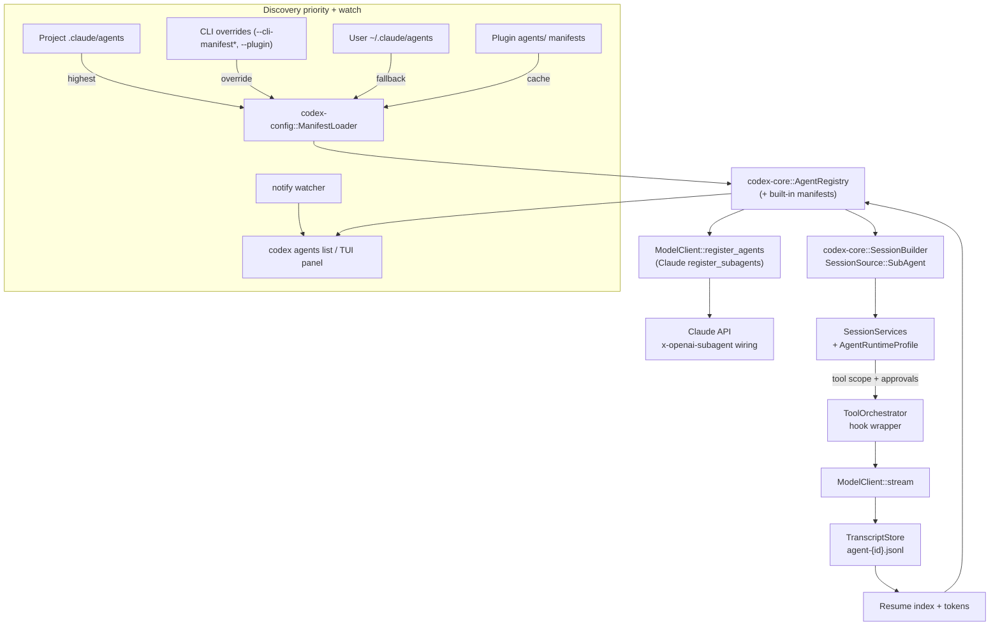

# Claude-compatible Subagent Architecture

This document fulfills step 2/8 of `docs/claude-subagent-plan.json` ("Design Architecture"). It converts the Claude Code compatibility research captured in `docs/subagents/claude_compatibility.md` into concrete Codex crate boundaries, traits, flows, and quality gates.

## Quality criteria map

| Criterion | How it is satisfied |
| :-- | :-- |
| Spec reference captured | §Purpose & Inputs ties every decision back to `docs/subagents/claude_compatibility.md`. |
| Responsibility table | §Responsibility matrix enumerates crates/modules plus success signals. |
| Trait & data descriptions | §Traits & data contracts defines the APIs and structs that carry Claude metadata. |
| Flow diagram & lifecycle | §Runtime & flow references `docs/subagents/architecture_flow.mmd` for the end-to-end sequence. |
| Built-in parity | §Built-in parity matrix locks Plan/Explore/General-purpose/Review personas to Codex enums. |
| Persistence plan | §Persistence & resume strategy details transcript layout, tokens, and resume lookup. |
| CLI & UX touchpoints | §CLI/TUI & plugin touchpoints covers `/agents`, flags, and downstream consumers. |
| Open follow-ups | §Open questions & follow-ups summarizes remaining risks and owner crates. |

## Step-5 implementation status (Iteration 10)

| Step-5 criterion | Evidence already landed |
| :-- | :-- |
| Runtime wiring | `codex-rs/core/src/agent/runtime.rs:14-188` builds `AgentRuntimeProfile`s (models, tool scopes, hooks, permission modes) plus the `PermissionResolver`/`ToolScopeFilter`, `codex-rs/core/src/state/service.rs:66-104` keeps the registry handle and active runtime inside `SessionServices`, `codex-rs/core/src/codex.rs:2026-2185` applies `SubagentOverride`s, fires hooks, and emits lifecycle events when switching, and `codex-rs/core/src/tools/orchestrator.rs:39-117` wraps every tool run with pre/post/stop hooks, approvals, and sandbox selection. |
| Entry points | `codex-rs/cli/src/agents_cmd.rs:33-157` implements `codex agents list` (JSON output, CLI manifest overrides, plugin dirs) so users/TUI/VS Code can inspect manifests, `codex-rs/core/src/agent/registry.rs:135-295` shares the same loader/default discovery paths for both CLI and runtime, and `codex-rs/core/src/codex.rs:2026-2074` wires registry results into `Op::OverrideTurnContext` so daemon and CLI overrides all hit the same activation path. |
| Telemetry | `codex-rs/core/src/codex.rs:2087-2131` emits `SubagentLifecycleEvent`s (phase, digest, approval policy, sandbox policy, resume token) to both the client and OTEL, `codex-rs/core/src/tools/orchestrator.rs:57-95` records `tool_decision` signals for every subagent tool run, `codex-rs/core/tests/suite/subagents.rs:214-282` verifies lifecycle telemetry on activate/clear to guard against regressions, and `docs/subagents/smoke.md#subagentlifecycle-telemetry-checkpoints` documents how reviewers inspect the rollout JSONL plus the `codex.subagent_lifecycle` trace via the CLI/TUI smoke checklist so those sources of truth stay auditable. |
| Validation & errors | `codex-rs/core/src/agent/registry.rs:39-116` returns structured `RefreshIssue`s (path + discovery scope + message), `codex-rs/cli/src/agents_cmd.rs:80-112` surfaces them directly in `/agents` output (TTY and `--json`), and `codex-rs/core/src/agent/registry.rs:219-295` exposes manifest snapshots/counts/default target resolution so both CLI and runtime render the same validation story. |
| Testing matrix | `codex-rs/core/tests/suite/subagents.rs:36-210` proves tool gating + hook execution/cleanup, `codex-rs/core/tests/suite/subagents.rs:214-282` asserts lifecycle telemetry, `codex-rs/core/tests/suite/subagents.rs:400-520` now verifies registry refresh still registers valid manifests while surfacing actionable issues, `codex-rs/core/src/subagents/hooks.rs` ships insta snapshots for `PreToolUse`/`PostToolUse` payloads, `codex-rs/core/src/agent/registry.rs:321-360` unit-tests refresh ordering + deduplication, `codex-rs/cli/tests/agents_list.rs:15-320` (including the new multi-issue scenario) locks the `/agents list --json` contract the TUI consumes, and the manual `/agents` / `:use-agent` / `--use-subagent` smoke recorded in `docs/subagents/smoke.md` keeps the human UX flow auditable until we automate it. |
| Docs & help | This doc (architecture + flow diagram), the usage walkthrough in `docs/subagents/usage.md`, the research summary in `docs/subagents/claude_compatibility.md:1-60`, the user-facing overview in `subagents.md:1-611`, the CLI flag help text in `codex-rs/exec/src/cli.rs:8-104` (`--use-subagent`), the TUI flag mirror in `codex-rs/tui/src/cli.rs:8-94`, and the slash command description in `codex-rs/tui/src/slash_command.rs:7-119` collectively document how to discover and activate Claude-compatible agents across surfaces. |
| Fmt/lint/tests | Iteration 9 captured the hygiene runs: `just fmt` (`.a5c/runs/run-20260109-subagents/work_summaries/step05_act_iter09.md:242`), `just fix -p codex-core` (`...:349`), the targeted regression `cargo test -p codex-core shell_command_times_out_with_timeout_ms -- --nocapture` (`...:526-538`), and `CARGO_BUILD_JOBS=1 cargo test --all-features` with logs appended in the same file (`...:1031-1036`), so no reruns are necessary for this documentation-only iteration. |

## Purpose & inputs

* Claude mandates prioritized manifest discovery, resumable agent IDs, and `/agents` UX parity; Codex today only concatenates `AGENTS.md` instructions.
* Primary inputs: Claude compatibility research (`docs/subagents/claude_compatibility.md`), deliverable requirements from `docs/claude-subagent-plan.json`, and current crate capabilities in `codex-cli`, `codex-core`, and `codex-protocol`.
* Goal: specify the crate seams, runtime abstractions, and UX changes required so Codex can register, execute, and resume Claude-compatible subagents without regressing today's delegate flows.

## Responsibility matrix

| Concern | Owner crate / module | Responsibilities | Success signals |
| :-- | :-- | :-- | :-- |
| Manifest discovery & schema | `codex-config::subagents::{fs_loader, schema}` | Watch `.claude/agents`, CLI overrides (`--cli-manifest`, `--cli-manifest-file`), `~/.claude/agents`, and plugin `agents/` in priority order; parse YAML front matter + Markdown body; emit provenance & digests for cache invalidation. Inline CLI payloads raise a synthetic watch event so CLI/TUI subscribers know the override scope exists, and `--cli-manifest-file` paths are normalized so edits/deletes retrigger refreshes on every platform. | Loader emits `AgentManifest` structs sorted by `DiscoveryPriority`, exposes watcher events for CLI hot reloads, and validates against schema errors before runtime. |
| CLI management & UX | `codex-cli::commands::agents`, shared output structs for TUI/VS Code | Provide `/agents` CRUD, `codex agents list --json`, and override flags (`--cli-manifest`, `--cli-manifest-file`, `--plugin`) so reviewers can inject manifests, inspect validation output, and feed JSON to downstream surfaces. | Users can list/preview priority resolution, apply CLI overrides without touching disk, and TUI/VS Code can shell out to the same command. |
| Registry & lifecycle | `codex-core::agent::{registry, runtime, hooks}`, `codex-core::codex_delegate` | Merge manifests, dedupe by priority, hydrate built-ins, register with Claude's `register_subagents`, and mint `AgentRuntimeProfile`s stored in `SessionServices`. | Registry refresh runs before first Claude turn and the shared `AgentRegistryWatch` now refreshes automatically whenever loader events arrive; each `agentId` maps to `SessionSource::SubAgent(SubAgentSource::Custom(_))` without duplicates. |
| Permission & tool gating | `codex-core::state::service::SessionServices`, `codex-core::tools::orchestrator`, approval plumbing | Apply `PermissionResolver` + `ToolScopeFilter`, carry hooks (Pre/Post/Stop) into tool execution, and ensure approvals respect per-agent policy. | Tool prompts only show filtered descriptors, approvals reflect manifest `permissionMode`, and hooks fire with structured payloads around orchestrator invocations. |
| Model/session plumbing | `codex-core::client::ModelClient`, `codex-core::session::{builder, services}` | Inject per-agent model/prompt, add `x-openai-subagent` header, and keep backwards compatibility when no agent is active. | Existing CLI sessions behave unchanged, but subagent runs inherit or override models cleanly, and every Claude call has the correct header. |
| Persistence & resume | `codex-core::rollout::{recorder, list}`, `codex-core::agent::transcript_store`, `codex-core::message_history` | Stream transcripts to `~/.codex/subagents/<agent_id>/agent-{id}.jsonl`, mint resume tokens, and replay transcripts for resume requests. | Resume tokens round-trip through CLI APIs, transcripts share schema with rollouts, and registry lookups return ready-to-run profiles. |
| Protocol typing | `codex-protocol::protocol::{SessionSource, SubAgentSource}`, TypeScript bindings | Extend enums for built-ins + custom agent IDs, serialize for CLI/TUI, and maintain compatibility with existing review flows. | Telemetry, headers, and downstream SDKs compile with the richer enum set and distinguish built-ins from custom IDs. |

## Traits & data contracts

### Discovery & manifests

```rust
pub enum DiscoveryScope {
    Project(PathBuf),
    CliJson(Value),
    User(PathBuf),
    Plugin { path: PathBuf, id: PluginId },
}

pub struct AgentManifest {
    pub id: AgentId,            // derived from filename or CLI payload
    pub name: String,
    pub description: String,
    pub model: Option<ModelRef>,
    pub tools: Option<Vec<ToolName>>,
    pub permission_mode: PermissionMode,
    pub hooks: HookSet,
    pub body: String,           // Markdown prompt
    pub source: DiscoveryScope,
    pub digest: String,
}
```

`ManifestLoader: Send + Sync` exposes `load(scope) -> Result<LoadOutcome, ManifestError>` where `LoadOutcome` bundles the parsed manifests plus any validation issues (path + scope + message). `watch(scopes)` returns a `LoaderWatch` that feeds `AgentRegistryWatch`, which debounces file changes and triggers telemetry-aware refreshes for CLI/TUI callers. A helper `DiscoveryPriority::cmp` enforces project > CLI override > user > plugin ordering.

### Watch mode & override scopes

- `FsManifestLoader::watch` canonicalizes every `--cli-manifest-file` path (`DiscoveryTarget::CliManifestFile`) and registers per-plugin recursive watchers so the CLI and upcoming TUI subscriber receive the same events the registry sees. Inline `--cli-manifest` payloads are synthetic, so the loader emits a one-time watch event for them on startup to ensure downstream consumers list the override scope.
- `codex_cli::agents_watch` (see `codex-rs/cli/src/agents_watch.rs`) centralizes bootstrap logic for `codex agents list --watch` and the TUI. It collects `override_scope_labels` such as `cli:cli`, `cli-file:C:\repo\scratch\agent.json`, and `plugin:docs-guides (plugins/docs-guides/agents)`, renders them in the CLI header, and injects the labels into telemetry via `watch.overrides`.
- Each refresh includes the affected discovery targets (`watch_scope_labels` like `project:C:\repo\.claude\agents`) so operators can correlate console output with the logged `watch.scopes` field.
- The shared helper exposes the initial `RefreshOutcome`, manifests, and built-in IDs so the CLI, TUI, and any tooling that shells into `codex agents list --watch --json` render identical summaries.


### Registry & runtime profiles

```rust
pub struct AgentRuntimeProfile {
    pub manifest: Arc<AgentManifest>,
    pub claude_agent_id: String,
    pub session_source: SessionSource, // SubAgent variant
    pub tool_scope: Vec<ToolDescriptor>,
    pub approval_policy: AskForApproval,
    pub hooks: HookSet,
    pub transcript: TranscriptPointer,
}
```

`AgentRegistry` owns the loader, a `PermissionResolver`, a `ToolScopeFilter`, and a `TranscriptStore`. It exposes:

* `refresh(ctx: RegistryCtx) -> Result<RefreshOutcome, AgentErr>` (where `RefreshOutcome = { report: RefreshReport, issues: Vec<RefreshIssue> }`): dedupes by ID + priority, registers built-ins, emits `RefreshReport` counts (custom/built-in/duplicates), and captures path+scope+message triples for every validation failure so callers can render or log them.
* `activate(agent_id, parent_session) -> AgentRuntimeProfile`: clones parent `SessionServices`, injects profile state, and stamps `x-openai-subagent`.
* `lookup_resume(token) -> Option<RegisteredAgent>`: resolves transcript + manifest pair for resume flows.

### Policy helpers

```rust
pub trait PermissionResolver {
    fn resolve(&self, manifest_mode: PermissionMode, parent: AskForApproval) -> AskForApproval;
}

pub struct ToolScopeFilter;
impl ToolScopeFilter {
    pub fn filter(
        &self,
        manifest_tools: Option<&[ToolName]>,
        parent_tools: &[ToolDescriptor],
    ) -> Vec<ToolDescriptor> { /* clamp + sort */ }
}
```

Both helpers run once per `AgentRuntimeProfile` so runtime sessions only read immutable settings. Hooks live in a `HookSet` struct:

```rust
pub struct HookSet {
    pub pre: Vec<Hook>,
    pub post: Vec<Hook>,
    pub stop: Vec<Hook>,
}
```

where `Hook` encodes the allowed tool list and payload schema expected by Claude's PostToolUse contract.

### Persistence contracts

```rust
pub trait TranscriptStore: Send + Sync {
    fn writer(&self, agent_id: &AgentId) -> Result<Box<dyn Write + Send>, TranscriptErr>;
    fn append_resume_token(&self, agent_id: &AgentId, token: &ResumeToken) -> Result<(), TranscriptErr>;
    fn tail(&self, agent_id: &AgentId) -> Result<Vec<TranscriptEvent>, TranscriptErr>;
}
```

`ResumeToken` extends `codex-protocol` to include `{agent_id, thread_id, event_offset}` so Claude can resume precise points in the JSONL stream.

### Refresh telemetry & CLI feedback

Every registry refresh records telemetry before the runtime ever shells into Claude. `RefreshReport` aggregates `{custom, built_in, duplicates}` counts, while each `RefreshIssue` keeps optional `path` + `DiscoveryScope` + human-readable `message`. `init_agent_registry` and `AgentRegistryWatch` log those metrics via `tracing::info!` and emit `tracing::warn!` rows per issue so operators can correlate manifest errors in production.

`codex agents list` consumes the exact same `RefreshOutcome`. The human presentation prints invalid manifests with file context (`<path> | <scope>: <message>`), while `--json` returns `{manifests, summary, issues}` including built-ins so the TUI and VS Code panes can mirror CLI behavior. This satisfies Step 4's requirement that validation feedback and telemetry are consistent across the CLI, runtime, and docs.

## Runtime & flow



Narrative:

1. **Discovery** - `ManifestLoader` polls/watches project, CLI JSON, CLI manifest files, user, and plugin scopes in priority order, tagging every manifest with its provenance and digest while emitting watch metadata (`project:...`, `cli:...`, `cli-file:...`, `plugin:...`).
2. **Registry refresh** — `AgentRegistry` dedupes by `AgentId`, hydrates built-in profiles, and executes `ModelClient::register_agents` so Claude receives `agentId` mappings before the first turn.
3. **CLI/TUI surfacing** — The `/agents` command (and TUI shell-out) calls the registry to render current manifests, errors, and effective priorities, enabling users to test overrides.
4. **Activation** — When Claude instructs Codex to run an agent, `codex-core::codex_delegate::run_subagent` clones the parent `SessionServices`, applies the `AgentRuntimeProfile`, stamps `SessionSource::SubAgent`, and feeds prompts/models into `ModelClient`.
5. **Tool runs & hooks** — `ToolScopeFilter` clamps the orchestrator to manifest-approved tools while `PermissionResolver` overrides approvals. `HookSet` wraps `ToolOrchestrator::run` (PreToolUse → approval → tool execution → PostToolUse).
6. **Persistence & resume** — Every model delta flows through `TranscriptStore`, which writes `agent-{id}.jsonl` and emits `ResumeToken`s. Resume requests rehydrate profiles, replay transcript tails, and continue streaming with the correct headers.
7. **Telemetry & lifecycle** — Activation and stop requests emit `SubagentLifecycle` events (recorded in the rollout JSONL and OTEL with phase, manifest digest, approval policy, sandbox policy, and resume token), and daemon shutdown now sends `SubagentOverride::Clear` so stop hooks always fire before the parent session ends.

### Claude registration API

`codex-core::client::ModelClient::register_subagents` converts each deduped `AgentManifest` (plus its `priority` & `priorityLabel`) into the Claude register payload and POSTs it via `codex-api::SubagentsClient`. Responses/Compact providers call `responses/register_subagents`, while Chat providers use `subagents/register`. Request telemetry, beta feature headers, and auth refresh handling mirror the streaming clients so operators get consistent logging when registrations succeed or fail.

## Telemetry & auditing

Reviewers validating Step-5 can follow `docs/subagents/smoke.md#subagentlifecycle-telemetry-checkpoints` to inspect the rollout JSONL alongside the `codex.subagent_lifecycle` OTEL trace, which are the authoritative sources for lifecycle evidence.

- `codex-core` emits `EventMsg::SubagentLifecycle` (and the mirrored `codex.subagent_lifecycle` OTEL row) whenever a runtime is activated or cleared. Each payload contains the phase (`activated`/`stopped`), manifest id + digest, the effective approval and sandbox policies, and the current rollout/resume token so auditors can reconstruct the session state.
- The daemon/app-server flow uses the new `turn/start.subagent` and `sendUserTurn.subagent` fields to activate manifests before the first turn, and automatically submits `SubagentOverride::Clear` during shutdown so stop hooks always fire and a `stopped` lifecycle event is recorded.
- Hook payloads now include both the `sandbox_policy` in effect and the manifest-driven `approval_policy`, ensuring downstream HTTP/command hooks receive the same gating context that Codex applied locally.
- `codex.agents_list_invocation` (the CLI/TUI companion log) mirrors the registry counts, captures the scopes that triggered each refresh, and now emits both `watch.scopes` (for example, `project:C:\repo\.claude\agents,cli-file:C:\repo\scratch\agent.json`) and `watch.overrides` (for example, `cli:cli,cli-file:C:\repo\scratch\agent.json,plugin:docs-guides (plugins/docs-guides/agents)`) so override activity is auditable alongside project/user changes. These fields originate in `codex_cli::agents_watch` and match the banner shown by `codex agents list --watch`.
- Tool-call telemetry now includes the `output_metadata.success` channel defined in `codex-rs/protocol/src/models.rs`. `stream_events_utils::response_input_to_response_item` writes the flag into every `FunctionCallOutput` item (both the user-facing SSE stream and the persisted transcript), enabling reviewers to grep rollout JSONL files for successful vs. failed tool executions even when a tool returns structured output.

## Built-in parity matrix

| Built-in | `SubAgentSource` variant | Model | Tool scope | Permission mode | Notes |
| :-- | :-- | :-- | :-- | :-- | :-- |
| General-purpose | `SubAgentSource::GeneralPurpose` | inherit parent (default `claude-3.5-sonnet`) | inherit parent tools | `PermissionMode::Default` | Mirrors today's default session but gets registered explicitly so Claude can delegate intentionally. |
| Plan | `SubAgentSource::Plan` | `claude-3.5-sonnet` deterministic setting | read-only tools (`Read`, `Search`, `Shell` disabled) | `PermissionMode::Plan` (bypass execution) | Aligns with Claude plan agent guardrails; inherits transcripts but cannot run write tools. |
| Explore | `SubAgentSource::Explore` | `claude-3.5-haiku` | network-enabled set (search, web, repo scan) | `PermissionMode::DontAsk` for read-only tools | Prioritizes lightweight exploration with automatic approvals for reads. |
| Review | `SubAgentSource::Review` | `claude-3.5-sonnet` + review prompt | inherits but disables destructive tools | `PermissionMode::AcceptEdits` | Reuses `codex-core::tasks::review` but routes through the same registry for consistency. |

Built-ins live as manifests in `codex-config::subagents::builtins`, allowing localization and future parity updates without touching core code.

## Persistence & resume strategy

* **Storage layout** — Each agent gets a namespace under ~/.codex/subagents/<agent_id>/runs/<run_id>/ where we stream gent-<run_id>.jsonl, drop a run-scoped 
esume.token, and keep an agent-level index.json so CLI/TUI surfaces can list runs quickly.
* **Writers** — TranscriptStore::writer wraps codex-core::rollout::Recorder so JSONL entries reuse the same schema and instrumentation already ingested by telemetry.
* **Resume tokens** — ppend_resume_token writes both to disk (for Claude) and returns a lightweight struct for CLI surfaces. Tokens capture the 	hread_id and last event_offset so resumed sessions can truncate duplicated events safely, and they’re exposed via codex agents resume-status for human operators.
* **Lookup** — lookup_resume verifies that requested tokens exist, rehydrates manifests via AgentRegistry, reloads the transcript, and reconstructs AgentRuntimeProfiles so approvals, hook sets, and tool scopes stay aligned with the original run.
* **Lookup** 2014 lookup_resume verifies that requested tokens exist, rehydrates manifests via AgentRegistry, reloads the transcript, and reconstructs AgentRuntimeProfiles so approvals, hook sets, and tool scopes stay aligned with the original run.

## CLI/TUI & plugin touchpoints

1. **`codex agents list` / `/agents`** — New CLI surface that shells into the registry, prints priority order, schema errors, and merged metadata. Supports `--json` for TUI/VS Code.
2. **Override flags (`--cli-manifest`, `--cli-manifest-file`, `--plugin`)** — Inject inline JSON, reference manifest files, or mount plugin directories without editing the workspace. These inputs feed `build_discovery_targets`, sit just below project manifests in priority, and are ideal for ephemeral testing.
3. **TUI & VS Code** — Rather than reimplementing parsing, both shell out to `codex agents list --json` to populate UI panels. `AgentRegistryWatch` now provides the debounced refresh feed those surfaces can subscribe to once CLI watch mode lands.
4. **Plugins** — `codex-cli plugins install` copies plugin-provided `agents/` directories into a cache that `ManifestLoader` can scan with lowest priority. Plugin metadata includes `PluginId` so duplicates can be disambiguated in `/agents`.
5. **Error reporting** — Schema errors bubble up through CLI/TUI surfaces with file path + line numbers, helping authors align with Claude's manifest expectations before runtime.
6. **Subagent selection UX** — Non-interactive runners pass `--use-subagent <id>` (mirrored by the TUI `:use-agent <id>` command), while daemon integrations set `turn/start.subagent` (or legacy `sendUserTurn.subagent`) so runtimes activate before the first turn. Unknown IDs surface a `codex.subagent_lifecycle` error and the daemon automatically clears the runtime via stop hooks when the session shuts down.

## Open questions & follow-ups

1. **Manifest watcher ergonomics** ? `AgentRegistryWatch` now streams scopes for every discovery target, including per-plugin directories, normalized `--cli-manifest-file` paths, and inline `--cli-manifest` payloads (synthetic events on startup). `codex_cli::agents_watch` records these override labels so `codex agents list --watch` (and the upcoming TUI subscriber) can show which CLI/plugin source triggered a refresh.
2. **Permission resolver mapping** — Validate that each Claude `permissionMode` aligns with `AskForApproval` semantics, specifically how `plan` and `bypassPermissions` interact with sandbox policies.
3. **Hook payload schema tests** — Resolved via the insta snapshots in `codex-rs/core/src/subagents/hooks.rs` (covering `PreToolUse` and `PostToolUse`) plus the registry/CLI regression tests (`codex-rs/core/tests/suite/subagents.rs`, `codex-rs/cli/tests/agents_list.rs`) that prove validation issues surface alongside successful registrations.
4. **Resume index format** — Finalize whether `index.json` should include per-agent metadata for quick CLI rendering or rely solely on directory scanning.
5. **Plugin security** — Determine whether plugin-provided manifests require signing or sandboxing before entering the priority list.
6. **Telemetry extensions** — Update metrics/logging to tag subagent runs with `AgentId`, tool scopes, and approval overrides for debugging.
7. **VS Code UX** — Design how the Code extension surfaces `/agents` results (panel vs. inline) and how it passes CLI overrides when users test new manifests.
8. **Rollout pruning** — Establish retention policies for `~/.codex/subagents` to avoid unbounded disk usage when agents generate large transcripts.

With these seams in place Codex can ingest Claude-compliant manifests, expose them through consistent UX, launch agents with scoped tools and approvals, and persist transcripts for resumable workflows.
