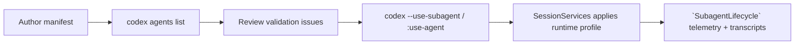

# Subagent Usage Guide

This guide walks through creating, registering, and operating Claude-compatible subagents inside Codex. It complements the architecture and smoke docs by focusing on day-to-day workflows plus a runnable demo manifest.

## Lifecycle overview



1. **Author** a manifest (YAML front matter + Markdown prompt).
2. **Register** it via `codex agents list`, which feeds the manifest loader/registry.
3. **Activate** it from the CLI (`--use-subagent`) or TUI (`:use-agent`).
4. **Observe** lifecycle telemetry and per-agent transcripts.

## 1. Create or copy a manifest

A ready-to-run example lives at `docs/subagents/examples/docs_demo_agent.md`. Copy it into your project scope so the loader can find it:

```bash
mkdir -p .claude/agents
cp docs/subagents/examples/docs_demo_agent.md .claude/agents/
```

The manifest is standard Markdown with YAML front matter:

```markdown
---
id: docs-demo
name: Docs Demo Agent
description: Drafts architecture updates and release-checklists from repo context.
model: claude-3.5-sonnet
permissionMode: default
tools:
  - read_file
  - shell
---
You are the Docs Demo Agent. Summarize repository changes and draft communication artifacts.
```

Key fields:

- `id`: unique identifier surfaced in `/agents`, `--use-subagent`, and telemetry.
- `model` / `permissionMode`: override the parent session defaults (`codex-rs/core/src/agent/runtime.rs`).
- `tools`: clamps tool access via `ToolScopeFilter`, ensuring deterministic behavior.
- Body: the system prompt executed when Codex activates the runtime profile.

## 2. Register and validate

Use the CLI helper to refresh the registry and surface validation issues:

```bash
codex agents list --json \
  --project-dir $(pwd)/.claude/agents \
  --user-dir ~/.claude/agents > /tmp/agents.json
```

- Every invocation emits a `codex.agents_list_invocation` telemetry row with the same scope counts and issue totals the registry records at runtime. When debugging, tail `~/.codex/log/codex-cli.log` (or provide `RUST_LOG=info`) and you can line up manual refreshes with the agent registry’s `codex.subagent_registry_refresh` stream.

- The human-readable view now mirrors Claude’s `/agents` summary: each manifest shows the provider (project/user/plugin/built-in), priority tier, tool scope, and a status line such as ``Status: ready - run `codex --use-subagent docs-demo` to activate`` so it’s obvious which ID `--use-subagent` will target.
- The JSON output stays backward compatible; downstream tools like the TUI panel and VS Code continue to shell out to `codex agents list --json` without changes.
- **Success**: `docs-demo` appears under `manifests` with `source: project`.
- **Validation errors** (missing fields, YAML typos) show up in `issues` with the file path, matching `RefreshIssue` structs.
- The TUI `/agents` panel simply shells into the same command, so once the CLI view is clean you can rely on the UI as well.

### Watch for changes

- Run `codex agents list --watch` (with or without `--json`) to subscribe to the same `AgentRegistryWatch` stream the TUI will consume. The CLI now prints an `Override scopes:` header based on `codex_cli::agents_watch`, so inline `--cli-manifest`, file-backed `--cli-manifest-file`, and `--plugin` directories are called out alongside project/user sources.
- Inline CLI payloads have no filesystem backing, so the loader emits a synthetic watch event on startup to prove that scope exists. File-backed overrides normalize their paths (Windows + Unix) and are monitored for edits, deletes, and re-creations, meaning `--cli-manifest-file` changes retrigger refreshes just like `.claude/agents`.
- Each refresh still logs `codex.agents_list_invocation` with `watch.scopes` (the paths that changed) plus `watch.overrides` (the CLI/plugin labels under watch), so operators can line up console output with telemetry when debugging.

Example watch session (shows both the JSON stream and the telemetry labels):

```bash
RUST_LOG=info codex agents list --watch --json \
  --cli-manifest '{"id":"docs-inline","name":"Inline Docs Agent","body":"Answer with repo docs."}' \
  --cli-manifest-file $(pwd)/scratch/agent.json \
  --plugin docs-guides=$(pwd)/plugins/docs-guides/agents
```

Sample output and log lines:

```text
Override scopes: cli:cli | cli-file:C:\work\codex\scratch\agent.json | plugin:docs-guides (C:\work\codex\plugins\docs-guides\agents)
{"event":"refresh","timestamp":"2026-01-15T17:03:11Z","scopes":["initial"],"result":{"status":"success", "summary":{"custom":3,"built_in":4,"duplicates":0},"issues":[]}}
{"event":"refresh","timestamp":"2026-01-15T17:03:18Z","scopes":["project:C:\work\codex\.claude\agents","cli-file:C:\work\codex\scratch\agent.json"],"result":{"status":"success", "summary":{"custom":3,"built_in":4,"duplicates":0},"issues":[]}}
INFO codex_cli::agents_cmd > event.name=codex.agents_list_invocation invocation=watch status=success watch.scopes=project:C:\work\codex\.claude\agents,cli-file:C:\work\codex\scratch\agent.json watch.overrides=cli:cli,cli-file:C:\work\codex\scratch\agent.json,plugin:docs-guides (C:\work\codex\plugins\docs-guides\agents)
```

Use `tail -f ~/.codex/log/codex-cli.log | rg watch.overrides` to verify the telemetry fields without waiting for a JSON event.

### Inject CLI overrides and plugin manifests

- `codex agents list` (and any `codex exec`/daemon session) accepts inline or file-backed manifests via `--cli-manifest '{"json"}'` and `--cli-manifest-file path/to/manifest.json`. Repeating the flag appends additional overrides; their priority sits between project and user scopes (project > CLI > user > plugin).
- Plugin manifests can be mounted without installation by repeating `--plugin plugin_id=/absolute/path/to/agents`. Each directory is scanned as the lowest-priority tier unless a manifest shares an id with a higher scope, in which case the loader records a skipped-duplicate issue.
- Example (list everything plus a one-off inline override and a plugin directory):

  ```bash
  codex agents list --json \
    --cli-manifest '{"id":"docs-inline","name":"Inline Docs Agent","body":"Answer with repo docs."}' \
    --cli-manifest-file $(pwd)/scratch/agent.json \
    --plugin docs-guides=$(pwd)/plugins/docs-guides/agents
  ```

- The same flags work for runtime sessions: `codex --cli-manifest-file scratch/agent.json --use-subagent docs-inline "summarize the docs"` injects the manifest before `init_agent_registry` runs so the activation path matches the list output.

## 3. Activate from CLI or TUI

Non-interactive sessions can pin a subagent for the entire run:

```bash
codex --use-subagent docs-demo --json "Draft a release note outline for the new telemetry work"
```

Inside the TUI or VS Code, switch per conversation:

```
:use-agent docs-demo
```

- When a subagent is active, `codex exec` prints a short status banner (`subagent active: Docs Demo (docs-demo) - model: claude-3.5-sonnet; tools: restricted to read_file`) before streaming the response so you can confirm the manifest, model, and tool scope that will run.
- The TUI shows an always-visible header above the transcript with the active agent name, model, tool summary, and a reminder that you can type `:use-agent <id>` (or start a new session with `--use-subagent <id>`) to switch. When no subagent is active the banner reflects the default session.
- Use `:use-agent` without arguments (or re-run the CLI without `--use-subagent`) to return to the primary agent; the banner updates automatically as lifecycle events arrive.
- `codex exec --use-subagent …` and `:use-agent` both emit `codex.subagent_client_switch` breadcrumbs (origin `exec_flag` or `slash_command`). Pair these with the `codex.subagent_lifecycle` entries in the rollout JSONL to prove which manifest was requested, whether activation succeeded, and what session triggered the change.

Codex routes the request through `SubagentOverride::Activate` (`codex-rs/core/src/codex.rs`), cloning the manifest's runtime profile (model, approvals, hooks, tool scope) into `SessionServices`.

### Built-in personas (Plan / Explore / General-purpose / Review)

- `codex-subagent/src/builtins.rs` ships four manifests (`builtin-general-purpose`, `builtin-plan`, `builtin-explore`, `builtin-review`). `codex agents list` now leads with the `Claude built-in personas are always available` banner plus explicit `codex --use-subagent builtin-*`/`:use-agent builtin-*` hints even when `.claude/agents` is empty, so operators know the IDs without digging into manifests.
- CLI smoke (Plan): `codex --use-subagent builtin-plan --json "draft a 3-step remediation plan for the failing integration tests"`. The session banner + rollout JSON now show `session_source: subagent/plan` inside every `SubagentLifecycleEvent`, proving the runtime stamped `SubAgentSource::Plan` onto telemetry and downstream transports.
- TUI smoke (Explore): type `:use-agent builtin-explore`. The header flips immediately, lifecycle events stream, and clearing the agent records a `stopped` event with a resume token.
- Persistence check: after exercising each persona once, run `codex agents resume-status --json | jq '.[] | select(.agent_id|startswith("builtin-"))'`. Expect `session_source` values `subagent/general-purpose`, `subagent/plan`, `subagent/explore`, `subagent/review`, transcript paths under `~/.codex/subagents/builtin-*/runs/<run_id>/`, and non-empty resume tokens. These entries prove the built-ins support replay without user-provided manifests and connect the CLI/TUI UX to the transcript evidence reviewers inspect.

## 4. Observe lifecycle & telemetry

Every activation/stop emits `EventMsg::SubagentLifecycle` plus the mirrored OTEL trace (`codex-rs/otel/src/traces/otel_manager.rs`). To verify the Docs Demo agent:

```bash
codex --use-subagent docs-demo --json "summarize the docs" | tee /tmp/docs-demo-session.jsonl >/dev/null
ROLLOUT=$(jq -r 'select(.msg.type=="session_configured") | .msg.rollout_path' /tmp/docs-demo-session.jsonl | tail -n1)

tail -n 20 "$ROLLOUT" | rg SubagentLifecycle
```

Alternatively, follow the [telemetry checkpoints](smoke.md#subagentlifecycle-telemetry-checkpoints) to grep the rollout JSONL or TUI log in real time.

Per-agent transcripts are recorded per run under `~/.codex/subagents/<id>/runs/<run_id>/agent-<run_id>.jsonl`. Inspect them directly or run `codex agents resume-status` to list every agent along with each stored run (provider scope, last update, event count, transcript path, and the corresponding resume token).

### Tool-call success metadata

Every function/tool call now includes an `output_metadata.success` flag (see `codex-rs/protocol/src/models.rs` and `codex-rs/core/src/stream_events_utils.rs`). The CLI, TUI, and rollouts all persist this metadata so reviewers can audit tool outcomes without replaying the session. After running a command from step 4, inspect the rollout JSONL:

```bash
rg '"output_metadata":\{"success":false\}' "$ROLLOUT"
```

A successful tool call produces `"output_metadata":{"success":true}`. Pair this with `codex.subagent_lifecycle` entries to confirm that denied tool calls (`success:false`) line up with the manifest's tool scope or approval policy.

## 5. Recover or resume a subagent run

The recorder keeps every run’s transcript plus the matching resume token so you can restart long-running agents without losing context:

1. Inspect available runs:

   ```bash
   codex agents resume-status
   ```

   Each row now includes the agent id, provider scope (`SessionSource`), last updated timestamp, event count, transcript path, and the resume token. Add `--json` for machine-readable output or downstream tooling.

2. View the underlying files (optional). Every run lives under `~/.codex/subagents/<agent_id>/runs/<run_id>/` with `agent-<run_id>.jsonl` (events), `resume.token` (the serialized token surfaced in step 1), and `index.json` (the cached `TranscriptRunSummary` that feeds `resume-status`).

3. Resume the run by combining the regular session resume flow with the agent resume token. For the CLI:

   ```bash
   codex exec resume <SESSION_ID> \
     --use-subagent docs-demo \
     --agent-resume-token-file ~/.codex/subagents/docs-demo/runs/<run_id>/resume.token
   ```

   The TUI piggybacks on the same flags when you launch it via `codex resume ... --use-subagent <id> --agent-resume-token{,-file}`. Once the session is running you can switch agents inline with `:use-agent <id>` (the banner links to `codex agents resume-status` so you can copy tokens before hopping back in).

If a run becomes wedged (e.g., tool denied, network interruption), clearing the active subagent via `:use-agent default` (TUI) or `codex --use-subagent general-purpose` (CLI) ensures stop hooks fire, transcripts flush, and a `SubagentLifecycle` “stopped” record lands before you resume.

Telemetry + recovery flow: `codex agents resume-status` gives the durable record of resume tokens, while `codex.subagent_client_switch` shows the most recent activation/clear attempts for the same session id. If an operator reports that a resume token failed, you now have the CLI listing (counts, issues), the user action (client switch), and the lifecycle events to reconstruct what happened without re-running the scenario.

## 6. Iterate and share

- Updating the manifest's prompt or metadata only requires saving the file and re-running `codex agents list`.
- To demo changes rapidly, pass `--cli-manifest "$(cat inline.json)"` for inline payloads, `--cli-manifest-file inline.json` for file-backed JSON, or `--plugin staging=/tmp/plugin-agents` for plugin directories without editing `.claude/agents/`.
- Share the sample manifest by committing it (or your customized version) under `.claude/agents/` so teammates automatically receive it during workspace checkout.

## Troubleshooting

- **Agent missing**: run `codex agents list --json --project-dir <path>` and check the `issues` array for schema errors.
- **Unknown ID on activation**: ensure the manifest `id` matches the value passed to `--use-subagent`/`:use-agent`.
- **Tool denied**: the runtime enforces the `tools:` array; update the manifest or run the command from the parent session instead.
- **Telemetry missing**: confirm you are launching via the Codex CLI/TUI (not legacy clients) and re-check the rollout JSONL per the smoke doc.

## Related references

- [Architecture](architecture.md) – crate boundaries, registry responsibilities, and runtime flows.
- [Compatibility research](claude_compatibility.md) – Claude-specific requirements.
- [Smoke checklist](smoke.md) – manual CLI/TUI validation plus telemetry capture steps.
- [`subagents.md`](../subagents.md) – end-user overview of subagent concepts.
- [`codex-rs/exec/src/cli.rs`](../codex-rs/exec/src/cli.rs) – full CLI `codex --use-subagent` flag help and option reference.
- [`codex-rs/tui/src/cli.rs`](../codex-rs/tui/src/cli.rs) / [`tui/src/slash_command.rs`](../codex-rs/tui/src/slash_command.rs) – TUI startup flag and `:use-agent` slash-command descriptions.
